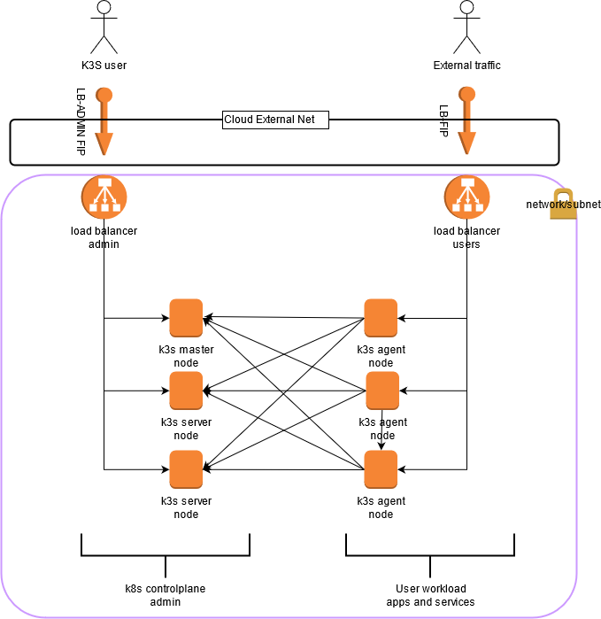
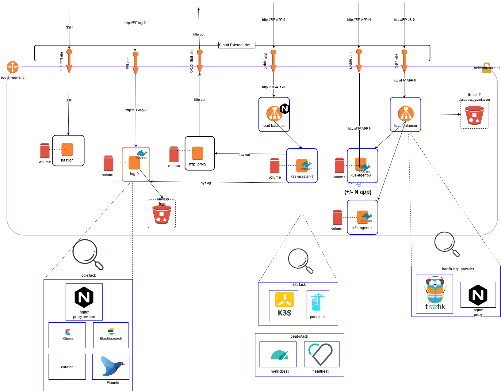

# terraform-openstack-k3s

[](https://github.com/pli01/terraform-openstack-k3s/actions/workflows/main.yml)

Terraform modules which creates a k3s cluster with portainer webadmin and multiple customized functional resources on an Openstack Project/Tenant

Project used:
* [k3s](https://k3s.io/)
* [portainer](https://www.portainer.io/)

Workload users are accessible through a dedicated URL from the `lb` instance and Floating ip

Administration of the kubernetes cluster is accessible through a decicated URL from the `lb_admin` instance and Floating ip, allowing:
* access to the kubernetes API
* administration by a web interface based on portainer.io

`k3s.io` allows you to easily deploy a fully kubernetes cluster in 2 steps
`portainer.io` allows you to have manage kubernetes cluster, users workload, authentification , console / web access to the cluster as well as to the pod / container!




This module create the following resources
  * 1 network/subnet
  * floating ips
  * security group/rule for bastion/http_proxy/loadbalancer/logs/k3s
  * 1 root volume acting as template snapshot volume for other instances
  * 1 bastion stack instance (for ssh acces)
  * 1 http_proxy stack instance (corporate proxy)
  * 1 log stack instance (override with your own url log_install_script)
  * N user load-balancer stack instances (override with your own url lb_install_script) with traefik http-provider to swift
  * N admin load-balancer stack instances (override with your own url lb_admin_install_script) with traefik http-provider to swift
  * 1 k3s master stack instance (override with your own url k3_master_install_script)
  * N k3s agent stack instances (override with your own url k3s_agent_install_script)
  * Terraform backend state stored in swift

K3 cluster will contain the portainer dashboard for easy admin




# Notes:

Prereq:
  * openstack credentials / tenant
  * (optional) dockerhub credentials
  * (optional) corporate http proxy credentials

this terraform module
  * provision openstack resources (network,volume,floating-ip security group,swift object)
  * provision instances with heat stack template (use wait_condition) and cloud_config template
  * customize cloud-init install script with install_script variables

Custom install script used:
  * [k3s cluster install](./samples/app/k3s/)
  * [user and admin load balancer docker stack (traefik+http-provider,nginx,openstack swift)](https://github.com/pli01/simple-traefik-http-provider)
  * [EFK log docker stack (Elastic,Kibana,Fluentd,Curator)](https://github.com/pli01/log-stack/)
  * [beat docker stack (metricbeat,heartbeat)](https://github.com/pli01/beat-stack/)

### Terraform variables
See details in `terraform/variables.tf` file and `examples` dir

Common variables
| Name | description | Value |
| --- | --- | --- |
| `prefix_name` | environment prefix | `test` |
| `image` | cloud image | `debian9-latest` |
| `vol_size` | root volume size (Go) | `10` |
| `vol_type` | volume type | `ceph` |
| `key_name` | key_name to allow ssh connection  | `debian` |
| `bastion_count` | bastion count (0 = disable, 1=enable) | `1` |
| `bastion_flavor` | bastion flavor | `standard-2.2` |
| `bastion_data_enable` | data added disk (true or false)| `false` |
| `bastion_data_size` | data disk size (Go)| `0` |
| `http_proxy_count` | http_proxy count (0 = disable, 1=enable) | `1` |
| `http_proxy_flavor` | http_proxy flavor | `standard-2.2` |
| `tinyproxy_upstream` | default tinyproxy_upstream | `["upstream proxy1:3128"]` |
| `tinyproxy_proxy_authorization` | tinyproxy_proxy_authorization | `base64(login:password)` |
| `dockerhub_login` | dockerhub_login | `login` |
| `dockerhub_token` | dockerhub_token | `token` |
| `github_token` | github_token | `github_token` |
| `docker_registry_username` | docker_registry_username | `docker_registry_username` |
| `docker_registry_token` | docker_registry_token | `docker_registry_token` |
| `syslog_relay` | syslog_relay  | `floating ip log stack` |
| `log_count` | log instance count (0 = disable, 1=enable) | `1` |
| `log_flavor` | log flavor | `standard-2.2` |
| `log_data_enable` | data added disk (true or false)| `false` |
| `log_data_size` | data disk size (Go)| `0` |
| `log_install_script` | log install script url to deploy | `https://raw.githubusercontent.com/pli01/log-stack/master/ci/docker-deploy.sh` |
| `log_variables` | log_variables map ({ VAR=value, VAR2=value2}) | `{}` |
| `metric_enable` | metric_enable on app instances (false, true) | `false` |
| `metric_install_script` | metric_install_script url to deploy | `https://raw.githubusercontent.com/pli01/beat-stack/master/ci/docker-deploy.sh` |
||||
| `traefik_user_hostname` | user URL | `["www.k3s.dev.my-domain.org","mysite.org"]` |
||||
| `lb_count` | lb instance count (0 = disable, 1=enable) | `1` |
| `lb_flavor` | lb flavor | `standard-2.2` |
| `lb_metric_variables` | metric_enable on app instances | `{}` |
| `lb_install_script` | lb install script url to deploy | `https://raw.githubusercontent.com/pli01/simple-traefik-http-provider/main/ci/docker-deploy.sh` |
| `lb_variables` | lb_variables map ({ VAR=value, VAR2=value2}) | `{}` |
||||
| `traefik_admin_hostname` | kubernetes Admin URL | `["k3s-admin.dev.my-domain.org"]` |
| `lb_admin_count` | lb instance count (0 = disable, 1=enable) | `1` |
| `lb_admin_flavor` | lb flavor | `standard-2.2` |
| `lb_admin_metric_variables` | metric_enable on app instances | `{}` |
| `lb_admin_install_script` | lb install script url to deploy | `https://raw.githubusercontent.com/pli01/simple-traefik-http-provider/main/ci/docker-deploy.sh` |
| `lb_admin_variables` | lb_admin_variables map ({ VAR=value, VAR2=value2}) | `{}` |
||||
| `k3s_master_count` | k3s master instance count (0 = disable, 1,2,3...N) | `1` |
| `k3s_master_flavor` | app flavor | `standard-2.2` |
| `k3s_master_data_enable` | data added disk (true or false)| `false` |
| `k3s_master_data_size` | data disk size (Go)| `0` |
| `k3s_master_metric_variables` | metric_enable on k3 master instances ({ VAR=value, VAR2=value2}) | `{}` |
| `k3s_master_install_script` | k3s master install script url to deploy | `https://raw.githubusercontent.com/pli01/terraform-openstack-k3s/main/samples/app/k3s/k3-master-install.sh` |
| `k3s_master_variables` | k3s_master_variables map ({ VAR=value, VAR2=value2}) | `{K3S_TOKEN = "_MY_SUPER_K3S_TOKEN_"}` |
||||
| `k3s_agent_count` | k3s agent instance count (0 = disable, 1,2,3...N) | `1` |
| `k3s_agent_flavor` | k3s agent flavor | `standard-2.2` |
| `k3s_agent_data_enable` | data added disk (true or false)| `false` |
| `k3s_agent_data_size` | data disk size (Go)| `0` |
| `k3s_agent_metric_variables` | metric_enable on k3 agent instances ({ VAR=value, VAR2=value2}) | `{}` |
| `k3s_agent_install_script` | k3s agent install script url to deploy | `https://raw.githubusercontent.com/pli01/terraform-openstack-k3s/main/samples/app/k3s/k3-agent-install.sh` |
| `k3s_agent_variables` | k3s_agent_variables map ({ VAR=value, VAR2=value2}) | `{K3S_TOKEN = "_MY_SUPER_K3S_TOKEN_"}` |

### Variables
You can override terraform variables
```
Variable Openstack credentials
OS_PROJECT_NAME=<CHANGE_DEV_TENANT>
OS_USERNAME=<CHANGE_USER>
OS_PASSWORD=<CHANGE_PASSWORD>
OS_AUTH_URL=https://identity.api.my-cloud.org/v3
OS_CACERT=/etc/ssl/certs/ca-certificates.crt
OS_IDENTITY_API_VERSION=3
OS_INTERFACE=public
OS_PROJECT_DOMAIN_NAME=tech
OS_REGION_NAME=region1
OS_USER_DOMAIN_NAME=tech
OS_INSECURE=true
export OS_AUTH_URL OS_CACERT OS_IDENTITY_API_VERSION OS_INTERFACE OS_PROJECT_DOMAIN_NAME OS_USER_DOMAIN_NAME OS_REGION_NAME OS_PROJECT_NAME OS_USERNAME OS_PASSWORD OS_INSECURE

Variable TF_VAR_xxxx
TF_VAR_tinyproxy_proxy_authorization = base64(login:password)

```

## Local build terraform

You can also test,validate,plan,apply terraform file from the local docker image before commit your work

* Build docker image with terraform/terragrunt
```
make build
```
* Test, plan, deploy
```
make tf-format PROJECT="terraform"
make tf-validate PROJECT="terraform"
make tf-plan PROJECT="terraform" TF_VAR_FILE="-var-file=/data/terraform/env/dev/config.auto.vars"
make tf-apply PROJECT="terraform" TF_VAR_FILE="-var-file=/data/terraform/env/dev/config.auto.vars"
# or
make tf-deploy PROJECT="terraform" TF_VAR_FILE="-var-file=/data/terraform/env/dev/config.auto.vars"
```
